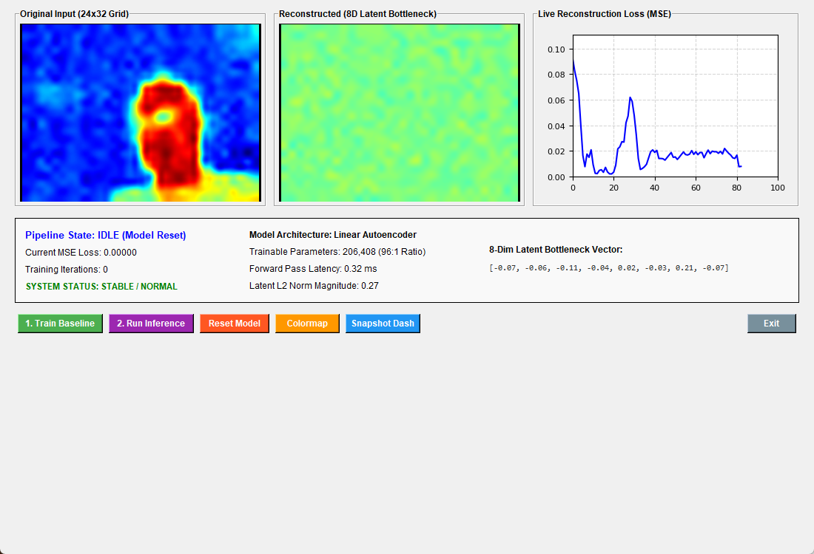
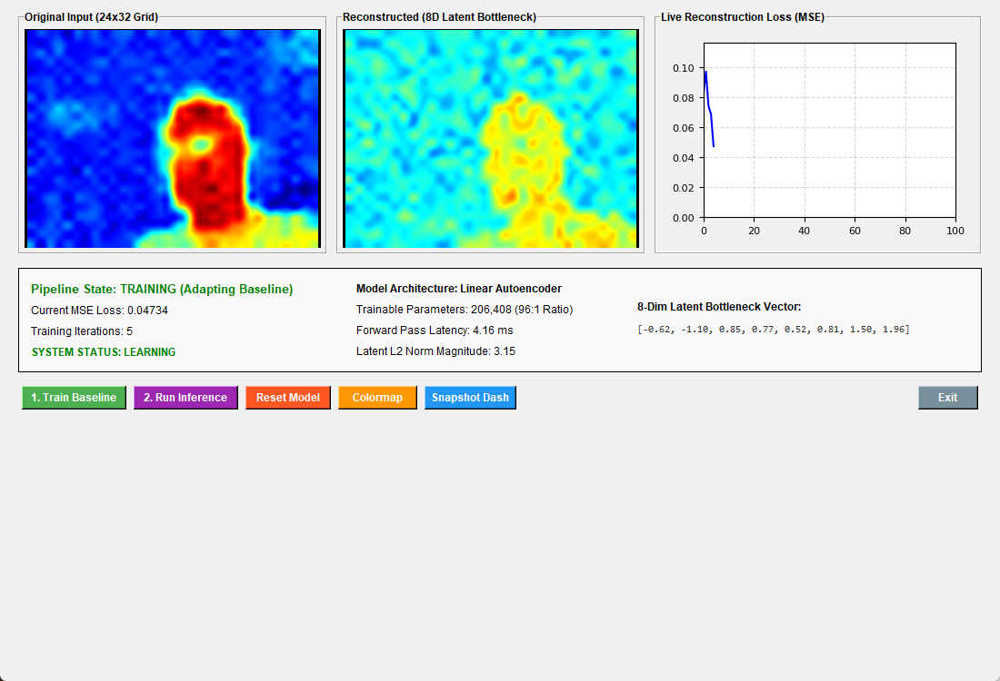
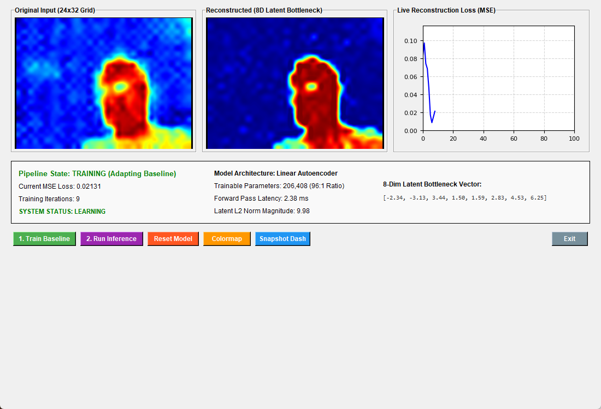
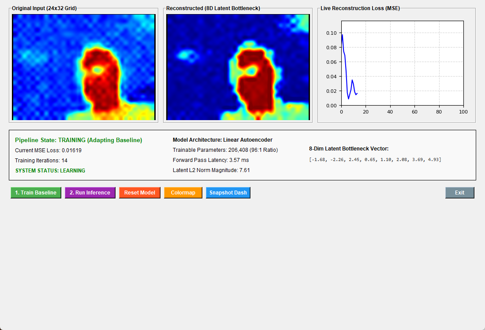
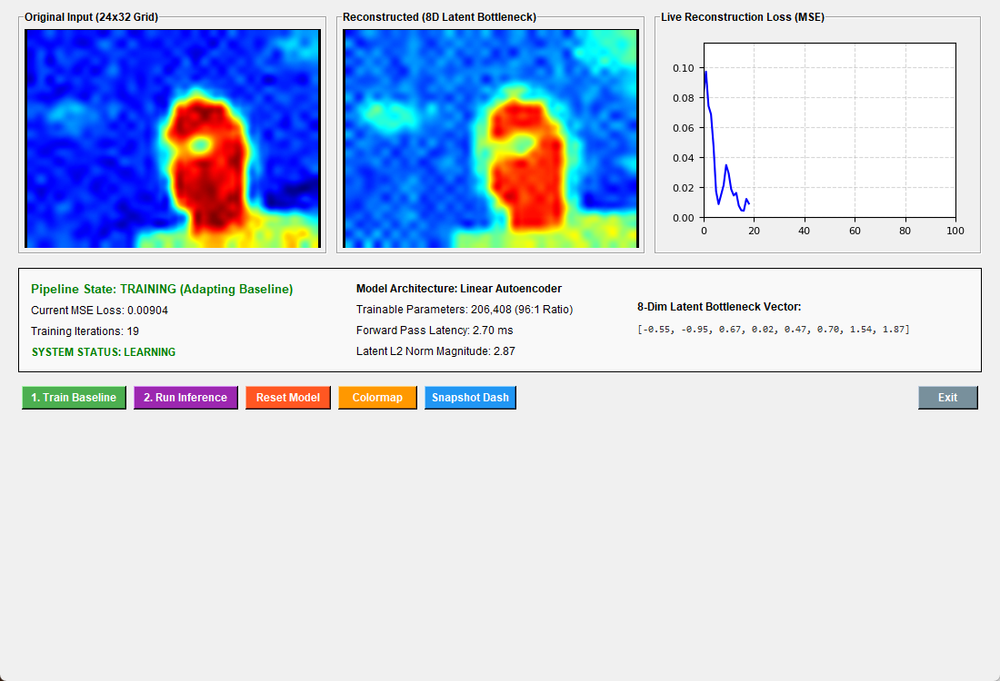
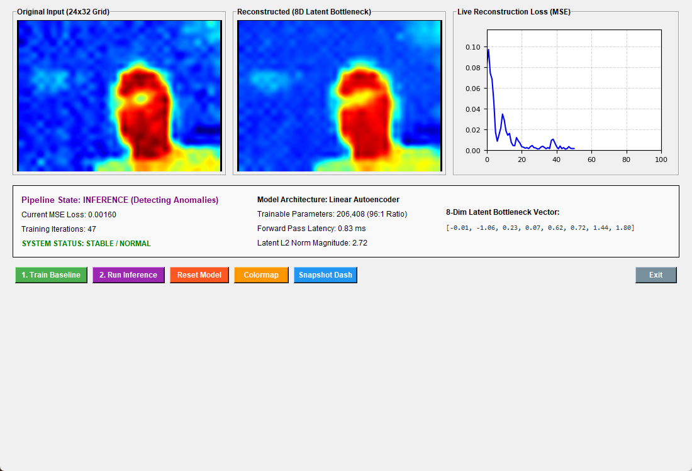
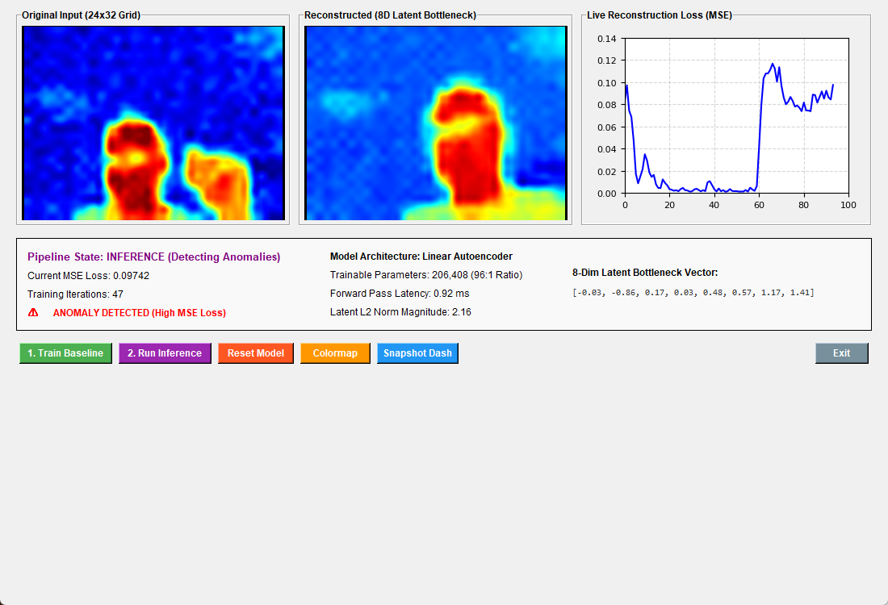

# ESP32 Thermal Stream - Pro ML Autoencoder & Anomaly Suite

A high-performance, real-time machine learning edge-AI system that combines an **ESP32 microcontroller**, an **MLX90640 24x32 thermal camera**, and a **PyTorch-powered desktop dashboard** for unsupervised thermal anomaly detection.

---

## System Architecture

* **Embedded Firmware (ESP32):** Interfaces with the MLX90640 sensor over 1 MHz fast-mode I2C, renders real-time bilinear interpolation on an ST7789 TFT display, and streams raw 768-pixel floating-point thermal grids at **500,000 baud** over serial.
* **Desktop Suite (Python / PyTorch / Tkinter):** Receives the live stream, normalizes thermal frames, and passes them through a custom linear autoencoder with an **8-dimensional latent bottleneck** (achieving a **96:1 compression ratio**).
* **Anomaly Detection:** Monitors reconstruction Mean Squared Error (MSE) loss in real time against a set threshold to instantly flag thermal anomalies.

---

## Hardware Requirements

* **Microcontroller / Display Board:** DIYmore ESP32 with integrated ST7789 TFT Display (170x320 resolution).
* **Thermal Sensor:** MLX90640 32x24 IR Array Sensor Module.
* **Wiring & Connectors:** JST/Dupont jumper wires for I2C (`SDA`, `SCL`) and power (`3.3V`, `GND`).
* **USB Connection:** High-speed serial telemetry (500,000 baud).

---

## Pinout / Connections

| Component Pin | ESP32 Board Pin | Description |
| :--- | :--- | :--- |
| **TFT_CS** | GPIO 15 | Chip Select for TFT |
| **TFT_DC** | GPIO 2 | Data/Command control |
| **TFT_RST** | GPIO 4 | Display Reset |
| **TFT_BL** | GPIO 32 | Display Backlight Control |
| **SDA** | GPIO 21 (Default) | I2C Data |
| **SCL** | GPIO 22 (Default) | I2C Clock |

---

## Training & Inference Stages

Below is the visual progression of the model, moving from initial setup through the training evolution phase to normal and anomalous inference states.

### 1. Initial / Idle State

* **Pipeline State:** IDLE (Model Reset).
* **Description:** Dashboard initialized with zero training iterations and a flat initial state awaiting baseline capture.

---

### 2. Training Evolution (Iterations 5 to 19)
During the training phase, the autoencoder adapts its weights to reconstruct the normal baseline thermal profile, causing the MSE loss to rapidly decrease.

* **Iteration 5:** Initial adaptation phase with an MSE loss of $0.04734$.
  

* **Iteration 9:** Mid-training convergence showing a reduction in loss to $0.02131$.
  

* **Iteration 14:** Refinement phase dropping reconstruction loss further to $0.01619$.
  

* **Iteration 19:** Stabilized baseline training with an optimized loss of $0.00904$.
  

---

### 3. Inference Phase: Normal State

* **Pipeline State:** INFERENCE (Detecting Anomalies).
* **Description:** The system operates in evaluation mode, successfully reconstructing standard thermal frames with a very low MSE loss ($0.00160$), indicating stable normal operations.

---

### 4. Inference Phase: Anomaly Detected

* **Pipeline State:** INFERENCE (Detecting Anomalies).
* **Description:** An unexpected thermal source enters the frame, causing the reconstruction loss to spike to $0.09742$ (crossing the anomaly threshold), triggering an immediate visual alert on the dashboard.

---

## Software & Dependencies

### Embedded / Arduino IDE Libraries
To compile and run the firmware sketch, ensure you have the following libraries installed via the Arduino IDE Library Manager:
1. **Adafruit GFX Library**
2. **Adafruit ST7789 Library**
3. **Adafruit MLX90640 Library**
4. **Wire** (Built-in)
5. **SPI** (Built-in)

### Desktop / Python Dependencies
* Python 3.8+
* PyTorch
* OpenCV (`cv2`)
* Matplotlib
* PySerial
* Pillow (`PIL`)

