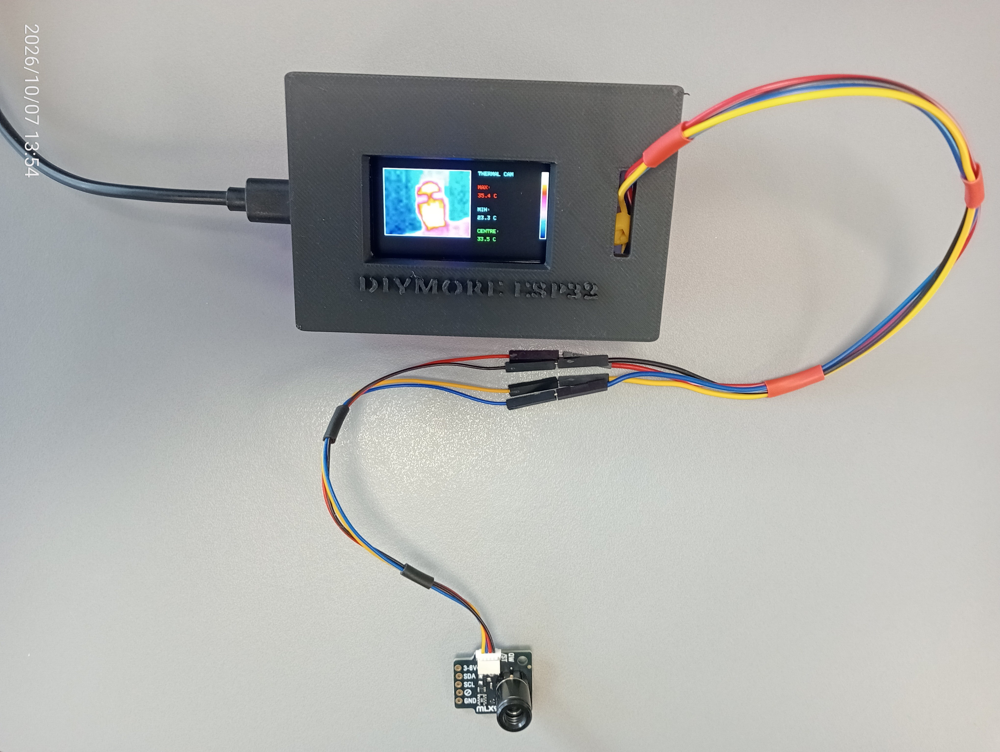

# ESP32 MLX90640 Real-Time Thermal Camera

A compact, high-performance real-time thermal imaging system powered by an **ESP32** and the **MLX90640 32x24 thermal array sensor**, featuring a smooth bilinearly interpolated display on an **ST7789 TFT screen**. 

*Figure 1: Fully assembled ESP32 and MLX90640 thermal camera prototype displaying real-time thermal gradients and live telemetry.*

---

## Features

* **Real-Time Thermal Imaging:** Streams data from the 768-pixel MLX90640 sensor array at up to 8 Hz.
* **Bilinear Interpolation:** Smooths the low-resolution 32x24 grid into a fluid visual representation on the ST7789 display.
* **Live Telemetry Readouts:** Dedicated sidebar tracking **MAX**, **MIN**, and **CENTRE** pixel temperatures in real-time.
* **Dynamic Colour Mapping:** Custom multi-stage Ironbow palette mapping (Black $\rightarrow$ Blue $\rightarrow$ Magenta $\rightarrow$ Red $\rightarrow$ Yellow $\rightarrow$ White) with an on-screen vertical legend bar.
* **Optimised Performance:** Uses I2C fast mode (1MHz) and SPI hardware acceleration for minimal latency.

---

## Hardware Requirements

* **Microcontroller / Display Board:** DIYmore ESP32 with integrated ST7789 TFT Display (170x320 resolution).
* **Thermal Sensor:** MLX90640 32x24 IR Array Sensor Module.
* **Wiring & Connectors:** JST/Dupont jumper wires for I2C (`SDA`, `SCL`) and power (`3.3V`, `GND`).

---

## Pinout / Connections

| Component Pin | ESP32 Board Pin | Description |
| :--- | :--- | :--- |
| **TFT_CS** | GPIO 15 | Chip Select for TFT |
| **TFT_DC** | GPIO 2 | Data/Command control |
| **TFT_RST** | GPIO 4 | Display Reset |
| **TFT_BL** | GPIO 32 | Display Backlight Control |
| **SDA** | GPIO 21 (Default) | I2C Data |
| **SCL** | GPIO 22 (Default) | I2C Clock |

---

## Software & Dependencies

To compile and run this sketch, ensure you have the following Arduino libraries installed via the Arduino IDE Library Manager:

1. **Adafruit GFX Library**
2. **Adafruit ST7789 Library**
3. **Adafruit MLX90640 Library**
4. **Wire** (Built-in)
5. **SPI** (Built-in)

